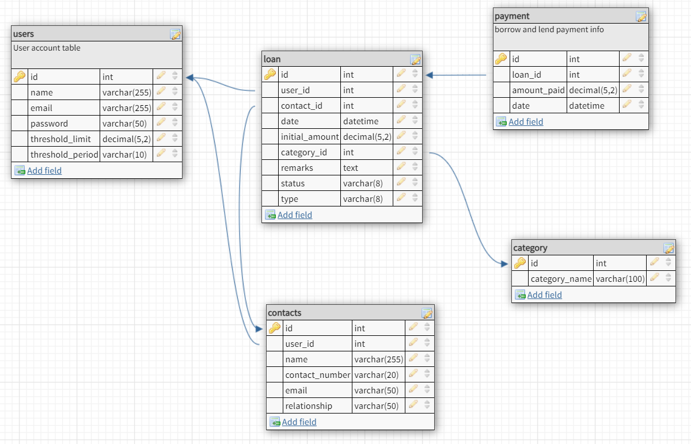
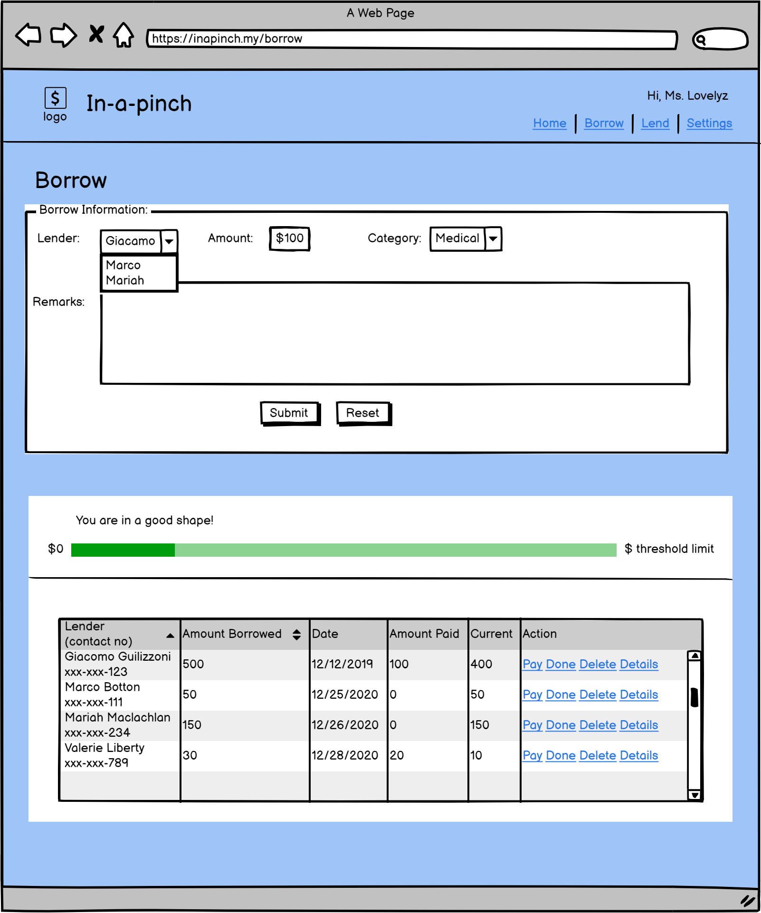

# Fullstack - BOR-LEND (Borrow Lend Tracker)

In this repository, you will use Nodes/Express, mySQL and Vue to build an SPA (Single Page Application) for the MVP.

## Table of contents

* [Project Description](#project-description)
* [Database Schema and API](#database-schema-and-api)
* [Setup](#setup)
* [Basic Requirements](#basic-requirements)
* [MVP](#mvp)
* [Future Feature](#future_feature)

## Project Description

The overall project is to assist user to monitor the borrowing and lending activities/history between a borrower to a lender or vice-versa. At the same time, the application should promote and instill healthy borrowing habits in the user. For this, project phase, we will work on the borrowing section (refer to MVP)  

### Borrower Definition

**FOR** individual borrower

**WHO** wants to monitor the money that they borrowed from other individual.

**THE** application **IS** a web-based system

**THAT** helps the borrower to keep track the amount they borrowed and have an overview over their borrowing limit

**UNLIKE** jotting down on paper or some files

**THIS APPLICATION** keeps the history of the borrowing as well the payment made without the user having problem to remember how much was borrowed or paid.

### MVP

The MVP for the borrowing section will mainly be on the loan creation and listing (borrow data), loan history insertion of the payment information and deletion of the borrow activities. At the same time, there is a summary of the total payment done and current borrowed amount.

### Current Feature

* Just a though - Borrower can add payment more than the borrowed money. The excess amount can be a'goodwill' or points to the lender. Or a plus point to the borrower of that lender genorisity
* The threshold has yet to display different color based on the basic requirement.

### Future Feature

* UI part/fixes which has not been addressed in this iteration – date display (in short format), total summary
* Threshold – borrow limit overview (in progress)
* User registration and Login
* Refactor – split the code into components
* Reminder - could be a message to email/whatsapp or calendar settings
* Main page
* Lending page
* Dashboard for the borrowing/lending overview
  Chart - total amount/summary by a lender or borrower
* Mobile version
* API for saving / financial tips (internal or external API)

### Project Dev Objectives

* Use API, components (Vue) for the client/frontend and mySQL to build the borrow SPA.
* Pass props to child components and propogate changes back up to parent components.
* Use API to get data from the database mySQL. Express as the middleware.
* Use state to respond to changes.

## Database Schema and API



* [DB Design](https://app.dbdesigner.net/dashboard#)

* [API Routes Design](https://docs.google.com/document/d/1Wg9DPmdZhoawXzJmP_82v_M2K7jV_KZY/edit)

## Technology

* Wireframe – balsamiq.com
* Database schema design – dbdesigner
* Database system - mySQL
* Express, Vue, Bootstrap Vue
* Postman - testing API
* Task management - Microsft Project

## Setup

### Dependencies

* Run `npm install` in project directory. This will install server-related dependencies such as `express`.
* `cd client` and run `npm install`. This will install client dependencies (Vue).

### Database Prep

* Access the MySQL interface in your terminal by running `mysql -u root -p`
* Create a new database called borrowlend: `create database borrowlend;`
* Add a `.env` file to the main folder of this repository containing the MySQL authentication information for MySQL user. For example:

```bash
  DB_HOST=localhost
  DB_USER=root
  DB_NAME=borrowlend
  DB_PASS=YOURPASSWORD
```

* Run `npm run migrate` in the main folder of this repository, in a new terminal window. This will create 5 tables of the borrowerlender database with some dummy data.

## Basic Requirements

### 1. Add the borrow page with a form and display the borrowing list on the same page

* [ ] Add functionality.
  When new borrow activity is added (i.e. clicking on the Submit), the new record should be displayed in the list.
  Proper form validation should be in place
* [ ] Add styling.
  The current page the user is on should be orderly.
* [ ] Optional - status threshhold bar
  The amount borrow should be reflected correctly on the threshold bar to indicate:
  a. Green: Good. Within healthy borrowing amount ( < 65% )
  b. Yellow: OK - Be careful ( <= 85% )
  c. Red: In danger of overborrowing
  d. Black: Overborrowed. Please reflect!



* The whole mock-ups are [here](https://balsamiq.cloud/su4rjdf/p3lwq8k/r2278)

### 2. Borrow listing

* [ ] Add functionality.
  The list should display all the borrowings which is active
  Each entry should have delete, pay, complete (or done) action.
* [ ] Add styling.
  Pleasing to the eyes.

### 3. Improve styling

* [ ] Play with the styling so this looks as professional as possible!

## Resources

* [Technical Specification](https://xxxx)

## Notes

_This is a student project that was created at [CodeOp](http://CodeOp.tech), a full stack development bootcamp in Kuala Lumpur._
